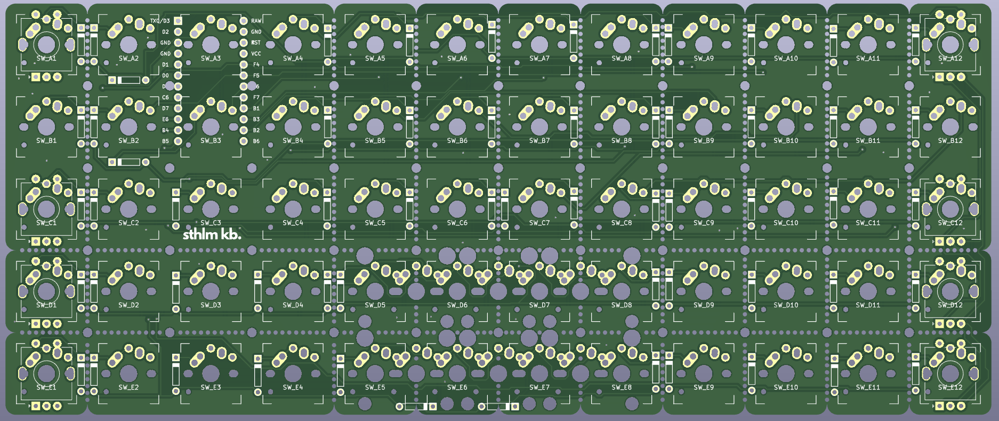
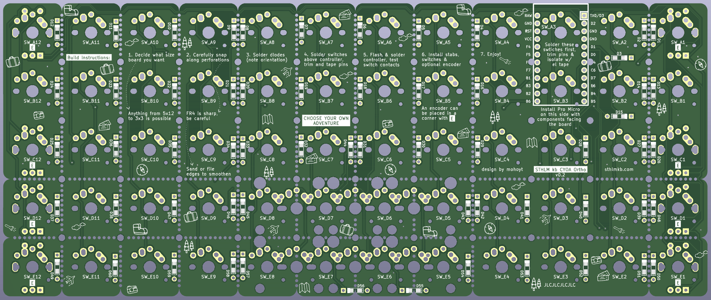

# CYOA Ortho

CYOA Ortho or Choose Your Own Adventure Ortho is a simple Pro Micro compatible ortho PCB that you can freely adjust to your preferences by snapping off rows or columns to make your perfect Ortho board. 

The board is a 5 row x 12 column board to begin with but with the perforations on the board you can make it almost any size down to 3 x 3. So you can build ortho layouts like the Preonic (5x12), Planck (4x12), Gherkin (3x10) or even a macro or num pad.

If you go with a 4 or a 5 row variant then you have the option to have 1 or 2 2u keys on the bottom row too.

An optional rotary encoder can be added in one of 8 positions.

## Build instructions

These are printed on the PCB. The build is pretty simple.

1. Decide what size board you want
2. Carefully snap along perforations on PCB. You might need a flush cutter to help start. FR4 is sharp so be careful and make sure to sand or file the edges to smoothen
3. Solder the diodes (either side is technically fine) just make sure that you have the right orientation for them. The black stripe on the diode should line up with the white stripe on the top of the board
4. Solder the 2 switches directly above the controller. Trim the pins and isolate them with electrical tape after so that they do not short on the controller.
5. Flash and solder the controller onto the board. Make sure to test all the switch contacts once you have done this. 
6. Install stabilisers (if you're using them), encoder (again, if you're using one) and      switches on the rest of the board.
7. Install in case. Enjoy.  

## Flashing instructions

See the firmware folder for more information.

There are example qmk files for 5x12 and 4x12 layouts for both QMK and Vial setups. These will need to be compiled using QMK or the Vial fork of Vial respectively. The `info.json` file contains all possible layouts so it should be possible to easily craft your layout using that as a starting point. 

## Plates
The CYOA Ortho is a bare PCB with no plate. It is theoretically possible to make a plate for it, and probably not hard either since it is a grid. A plate for a Planck or a Preonic could also be used if you have the same size.

## Cases
3d printed cases are available for CYOA Ortho. These are tray style and attach to the M2 holes on the PCB. Cases are available for all possible size variations.

## Changelog / known issues
- Version 0.1 had the wrong size Pro Micro footprint. This is updated in v0.2

